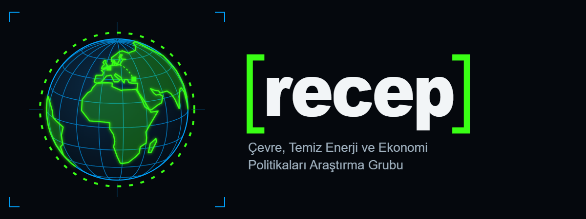

# recep

**recep — Çevre, Temiz Enerji ve Ekonomi Politikaları Araştırma Grubu** web sitesi.

Site [Quarto](https://quarto.org) ile üretilir ve GitHub Actions ile GitHub Pages'e yayımlanır: <https://continentofgrinch.github.io/recep/>

## hızlı başlangıç

```bash
quarto preview        # canlı önizleme
quarto render         # tam derleme -> _site/
```

Gereksinimler: Quarto **1.10.18** · R ≥ 4.3 (yalnızca R kodu içeren sayfalar için).

## bölümler

| menü | adres | kaynak |
|---|---|---|
| hakkımızda | `/hakkimizda/` | `hakkimizda/index.qmd` |
| proje | `/proje/` | `proje/*.qmd` |
| ekip | `/ekip/` | `data/ekip.yml` |
| çıktılar | `/ciktilar/` | `data/ciktilar.yml` |
| veri ve kod | `/veri-kod/` | `veri-kod/*.qmd`, `veri-kod/veri/` |
| araçlar | `/araclar/` | `araclar/*.qmd` (Observable JS), `araclar/veri/` |
| haberler | `/haberler/` | `haberler/posts/` |
| iletişim | `/iletisim/` | `iletisim/index.qmd` |

## içerik ekleme

| ne | nasıl |
|---|---|
| haber | `_sablonlar/haber.qmd` → `haberler/posts/YYYY-AA-GG-kisa-ad/index.qmd` |
| ekip üyesi | `data/ekip.yml`'ye bir blok ekleyin (`rol`: yurutucu / arastirmaci / danisman / bursiyer) |
| çıktı (not, makale, sunum) | `data/ciktilar.yml`'deki örnek bloğu kopyalayın; `bolum` alanı hangi alt sayfada görüneceğini belirler |
| bölüm içi yeni sayfa | `_sablonlar/sayfa.qmd` → ilgili klasöre; sidebar'a otomatik eklenir (`order` ile sıralanır) |

Başlıklar küçük harfle yazılır. **R kodu içeren sayfa** eklediyseniz yerelde `quarto render <dosya>` çalıştırıp oluşan `_freeze/` klasörünü de commit edin; CI R kurmaz.

## tasarım sistemi

- `theme.scss` — açık tema paleti ve tüm kurallar; `theme-dark.scss` — gece paleti (varsayılan tema).
- Dil: "Elegant Cyber-Renaissance / High-End Editorial Brutalism" — kutu ve neon çerçeve yok; saç çizgileri, bol boşluk.
- Gece (varsayılan): `#05080D` zemin, `#ECEAE4` metin. Açık: kırık beyaz `#F4F2EC` zemin, zifiri `#0A0A0A` metin. Neon yeşil yalnızca logoda.
- Tipografi 3 katman: **Inter 900** (yalnızca dev sayfa başlıkları ve logo; -0.06em) · **Lora** (tüm alt başlıklar, gövde, açıklamalar) · **Space Mono** (menü, meta etiketleri, butonlar, kod). CSS değişkenleri `--font-brutal`, `--font-editorial`, `--font-terminal` ve aynı adlı yardımcı sınıflar. Fontlar kendi sunucumuzda (`assets/fonts/`, SIL OFL 1.1).
- Marka dosyaları: `assets/marka/` (amblemler, yatay logolar). Navbar'daki dönen küre: `assets/js/kure.js`.
- **DynamicHero** (`_extensions/recep/hero/`, `_quarto.yml` içinde `filters: [hero]`): her sayfanın üstüne otomatik başlık alanı ekler. Ana sayfada ortada dönen dünya küresi; diğer sayfalarda sekmeye özgü Rönesans eseri tam opak, 1-bit dither bir tuval olarak durur ve dev başlık (Inter 900) tuvalin sol alt köşesine demirlenir; altında açıklama (Lora). Eser sayfanın klasöründen otomatik seçilir:

  | sekme | eser |
  |---|---|
  | ekip, 404 | Raphael — Atina Okulu |
  | haberler, iletişim | Holbein — Elçiler |
  | veri ve kod | Da Vinci — Codex Atlanticus f. 26v (ters: terminal / mavi baskı) |
  | araçlar | Jacopo de' Barbari — Luca Pacioli portresi |
  | proje, çıktılar | Michelangelo — Adem'in Yaratılışı |
  | hakkımızda | Rembrandt — Kumaşçılar Loncası Yöneticileri |

  Başlık `title`, alt satır `description` alanından gelir. İsteğe bağlı front matter: `hero: false`, `hero-eser`, `hero-baslik`, `hero-boyut: buyuk (16:9) | orta (21:9)`. Görseller `assets/sanat/` (kaynaklar `KAYNAK.md`).

## yayın

`main`'e her push'ta: derleme → iç link kontrolü → GitHub Pages. Pull request'lerde yalnızca derleme ve link kontrolü çalışır. Pages kaynağı: **Settings → Pages → Source: GitHub Actions**.

## devir (organizasyona taşıma)

1. **Settings → General → Transfer ownership** ile repoyu hedef hesaba devredin.
2. `_quarto.yml` içindeki `site-url`, `repo-url` ve GitHub bağlantılarını yeni adrese göre güncelleyin.
3. Yeni repoda **Settings → Pages → Source: GitHub Actions** ayarını doğrulayın.

## lisans

İçerik ve veri ürünleri [CC BY 4.0](https://creativecommons.org/licenses/by/4.0/deed.tr), kod MIT. Fontlar SIL OFL 1.1.
